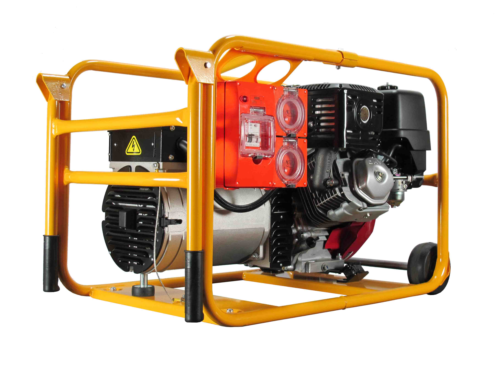

# Generators

Generators are the logic that creates new potential solutions. Generators can be very simple (a function that outputs totally random designs) or highly sophisticated (a network model that learns over time), but what they do is generate new data, in whatever form the user desires. 

In the table example, a generator is the block of code that churns out all the different design variants. In another case, a generator could spit out a series of floorplans. Generators are the engine of the algorithm, they give the rest of the program something to evaluate.

>*Not all generators look like this.*