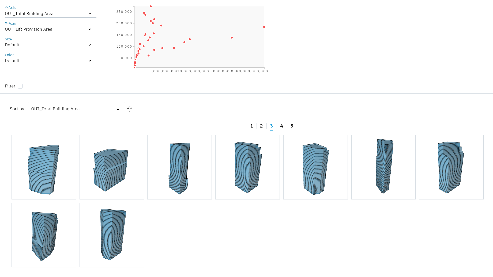

# Workflow 1 : Building mass generator

  

## Description

This graph used with Dynamo Refinery on `Randomize` mode, will generate a series of random towers, sitting across a stipulated site boundary. The tower will randomise in height, floor plates and orientation allowing for a vast amount of potential design solutions within minutes.

## Inputs

| Dynamo Input  | Input Description |
| :--- | :--- |
| Site boundary | Select the site boundary lines from the Revit model |

| Refinery Input  | Input Description |
| :--- | :--- |
| Site offset     | Give the site boundary an offset to limit the tower floor plate |
| Building height | Range in mm for the total height of the tower |
| Floor height    | Range in mm for the floor to floor height of the tower |
| U Values        | U Parameters at surface for the 7 points that will create the base floor plate |
| V Values        | V Parameters at surface for the 7 points that will create the base floor plate |

## Functions

The script is made up of a series of functions, which are divided into groups inside the graph. Each group has a name and a short description, where the name indicates the type of funciton that is being run and the description explains a bit more in detail the process.
This graph is taking the site boundary from Revit, the offset and the U and V values from the user inputs and generating the base floor plate for the new tower inside of the specified space. Based on the building height and the floor height the script generates all the other floors based on the initial floor plate with slightliy inward offsets on its sides. Once all the floor plates are in place the external walls are generated by lofting the outter floor boundaries. With the final building, the outputs are calculated.

## Visualization

All unnecesary geometry has been hidden from the graph in order to get a nice visual in the Refinery interface. Only the site boundary the tower external walls and floors will be visible. this will make easy the task of visually going through the options generated by the graph. For a better understanding of the exercise a series of context buildings have been inluded in the Revit sample file.

## Outputs

| Refinery Output     | Output Description |
| :--- | :--- |
| Public realm area   | Give the site boundary an offset to limit the tower floor plate |
| Total building area | Range in mm for the total height of the tower |
| Lift provision area | Range in mm for the floor to floor height of the tower |

## Refinery

The dynamo script by itself is able to generate one tower based on the user inputs, but combined with Refinery will allow users to generate as many options of the tower as they need. This script can be used with an optimizing study but works best with a randomizing study, as there are not many outputs that can be optimized. 

## Results

Once Refinery has finish running we can have a look at the outputs of the new study. 
This specific example was obtined from a randomized study based on 40 solutions.

