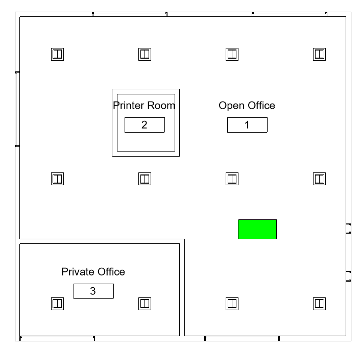
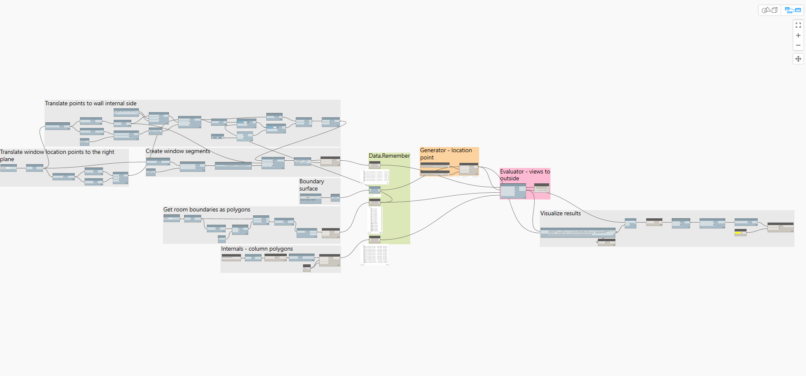
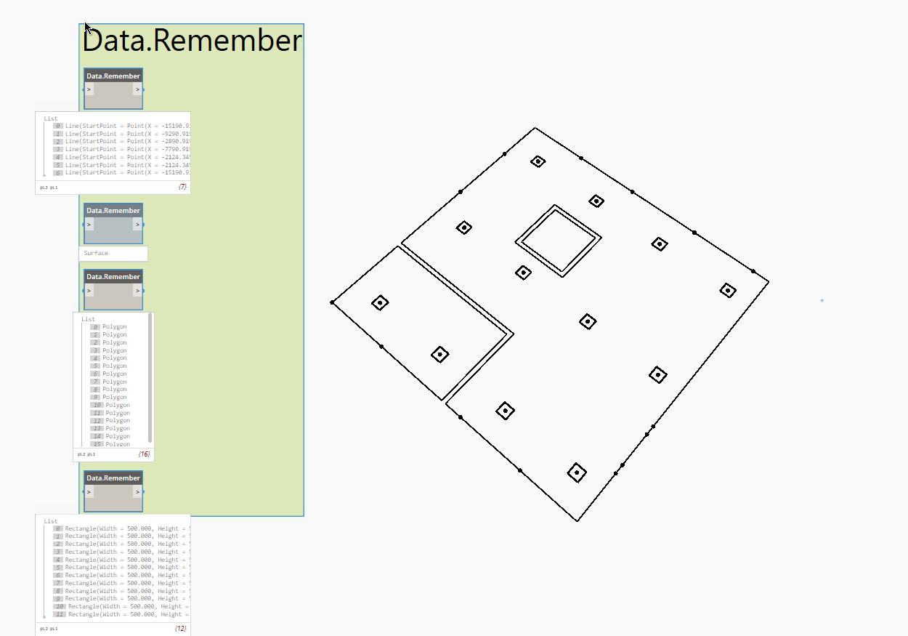
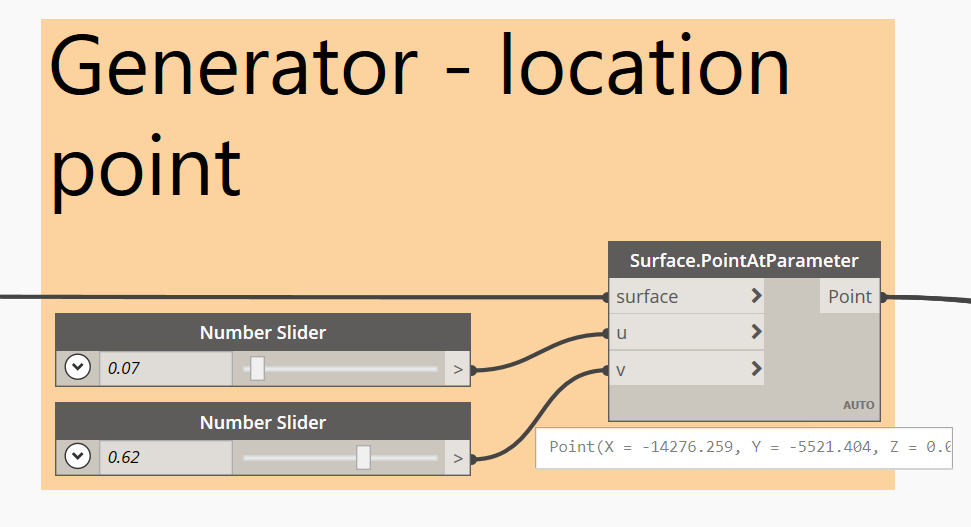
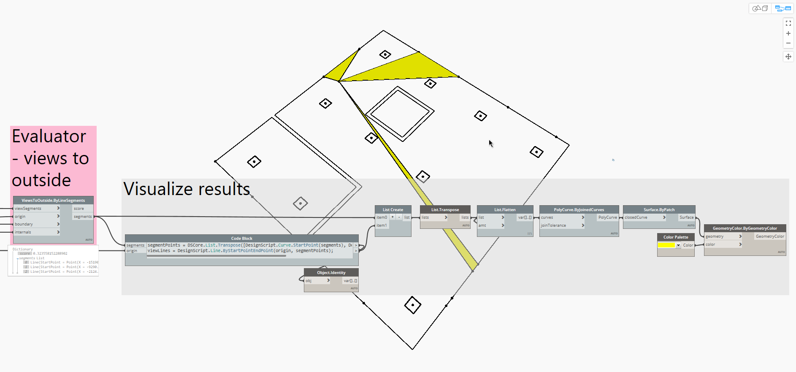
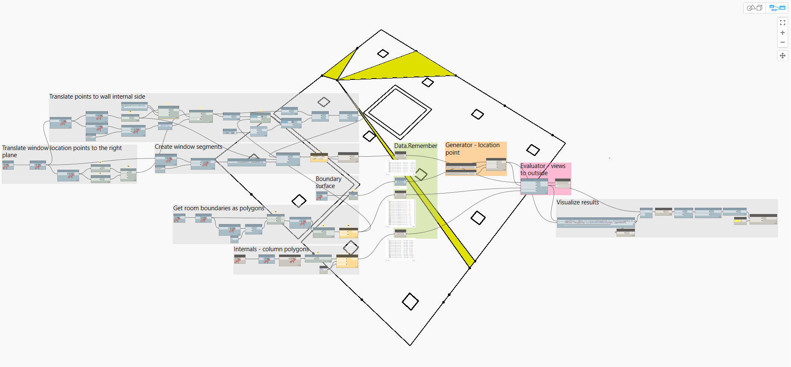
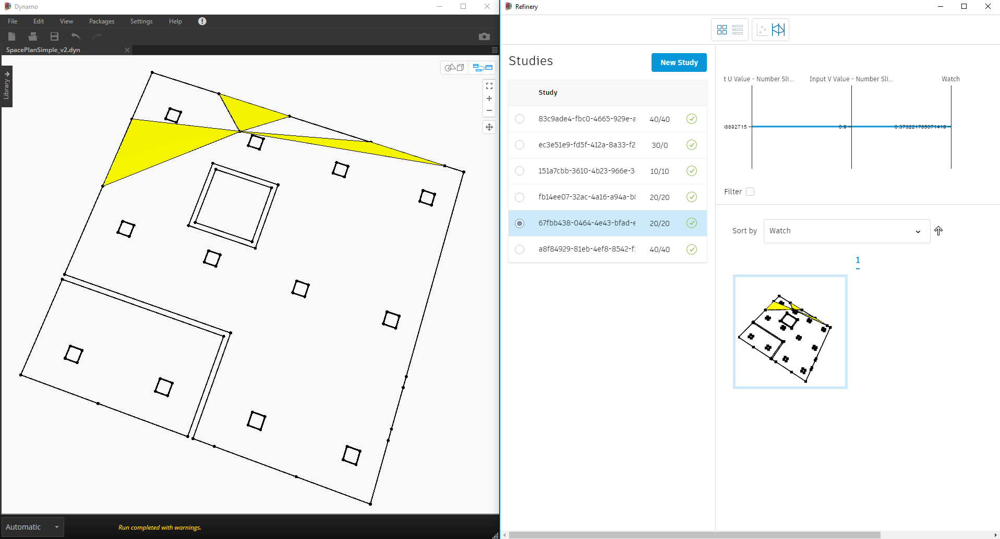
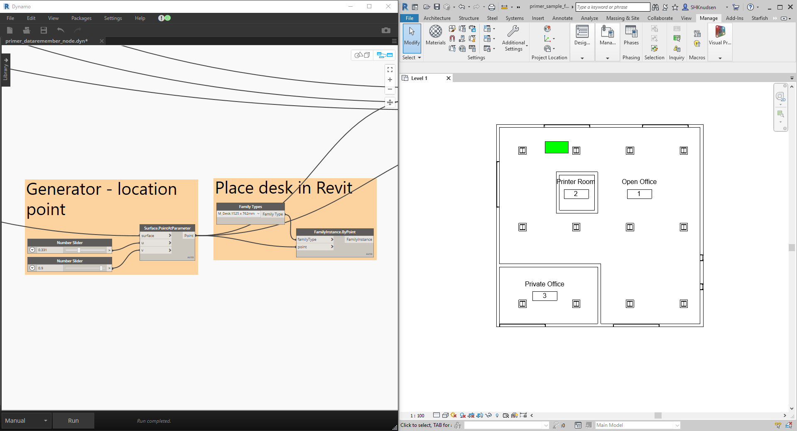

# Detailed example workflow

In the following example, we will use the steps from the previous section, and cache data from Revit. We will then perform an optimization process using Refinery to find the optimum solution before pushing the result back to Revit.

## About
The intention of this workflow is to find the best location for a desk in the office floor plate, where it maximizes the number of views to the outside. To do this the information we need to cache in the *`Data.Remember`* node is all the geometry relating to the bounding elements of the room (walls, doors, windows and internal obstructions).

With this data, we will use Refinery to perform an optimization process to determine the best location for the desk from the thousands of permutations, before using the result and pushing the value back into Revit.

## Script creation
The first step is to create our script. Remember, our script needs to contain both the generator to create the different options and the evaluators to assess the performance of each option against our criteria.

## Data.Remember node
In this example, there is a little work needed to extract the correct geometry from each of the Revit elements. For this workflow we require a set of polygons across a common plane. We extract this information from the walls, windows and internal columns through a combination of nodes in Dynamo. Once we have this geometry, we can use the *`Data.Remember`* node to cache the values in the script.

## Generator
The generator of the script determines how Refinery will move the point around the available space to find the best location.

## Evaluators
The evaluator of the script determines how each design option scores in relation to our overall goal. Remember the goal of this workflow was to maximize the views to outside. To enable this, we have a custom node that takes in:
* view segments (windows)
* origin (point location)
* boundary (overall floor plate)
* internals (any internal obstructions)

The output of the node returns both a visual and non-visual output:
* visible segments (sections of windows that can be seen from the point)
* score (a number between 0-1 that denotes a percentage amount of the total 360° view from the point)

## Dynamo Sandbox
With the graph correctly set up and run once in D4R to cache the data, we can close Dynamo and Revit and open Dynamo Sandbox. As per the previous example, the Revit nodes upstream of the *`Data.Remember`* node are marked as unresolved, but on running the graph the values are still cached in the *`Data.Remember`* nodes themselves.

## Refinery
Now we are ready to run through Refinery. In Refinery we want to select *`Optimize`*. For more details on how to run an optimization process please refer to [section 2-05](/2-getting-started/2-05_refinery-processes.md). For this study we want to *`Maximize`* the result. Refinery then goes to work to solve the design problem, using the population size and amount of generations to decide on the best option.

## Revit
To use the design option from Refinery, we simply click through either the charts or tables to select our chosen option.  More detail on this is found in [section 2-06](/2-getting-started/2-06_viewing-refinery-results.md). By clicking on the option in Refinery the input values used by the generator in Dynamo are set to the same nodes. Saving the graph saves these values back to the Dynamo file. Closing Dynamo Sandbox and reopening Revit, we can add some additional Revit nodes to the end of the graph. This will take the point generated by the best option in Refinery and place our desk (family instance).

