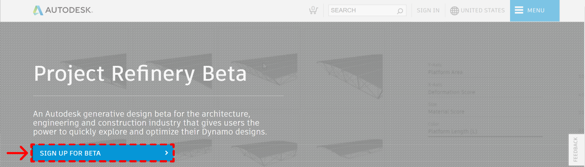
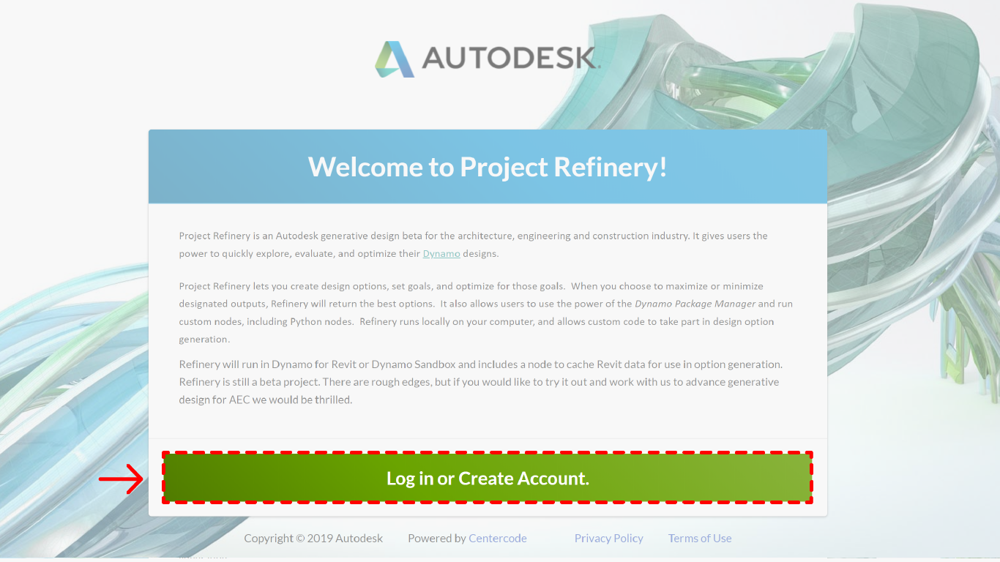
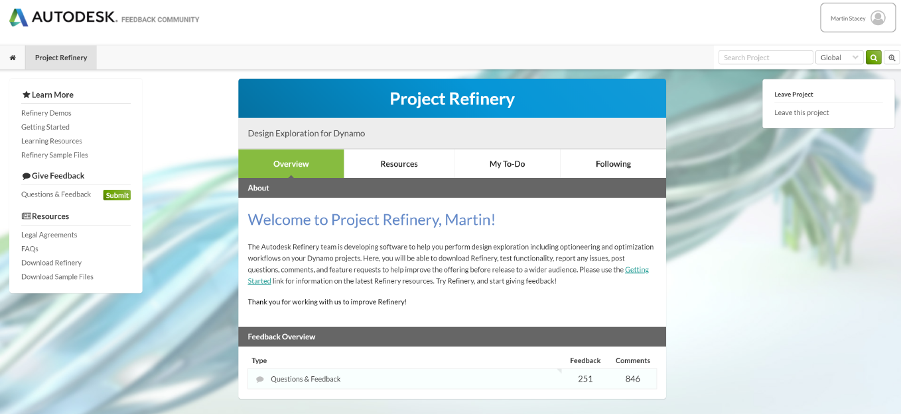
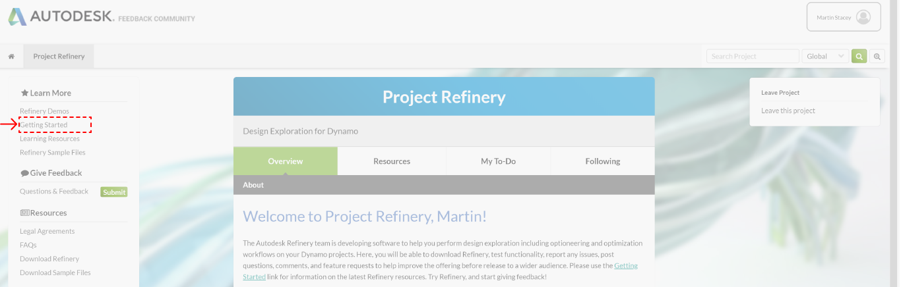

# 安装衍生式设计工具

拥有AEC Collection订阅账户的用户可以使用Revit2021版中的衍生式工具集。对于所有Revit2021用户来说，都可以使用其Dynamo for Revit 2021中的衍生式设计工具。如果你想在Revit 2020及其以下版本中使用Dynamo中的衍生式设计工具，你可以进入Project Refinery beta的网页，并且下载Refinery的最新版本。链接如下：

[https://www.autodesk.com/solutions/refinery-beta](https://www.autodesk.com/solutions/refinery-beta)

## 衍生式设计社区

登录了该测试版的网页后， 你将会看到整个衍生式设计社区中的内容。在这里，你能够：

* 看到软件开始和安装的详细介绍
* 得到样例文件或演示
* 得到更多的学习资源
* 可以提供反馈并且向AEC衍生式设计团队提问
* 与衍生式设计社区内的同行们进行讨论和合作

衍生式设计的任何一个版本的安装文件都能下载到本地电脑，并且安装。

_上图是：衍生式设计社区主页_

## 为Revit和Dynamo安装衍生式设计工具

需要安装最新版的衍生式设计工具时，进入网页左侧的“Getting Started”页面，在该页面中你将看到衍生式设计工具安装的前提条件（Pre-Requisites）部分。

确认你已经符合所有的软件安装前提条件后，请按照安装指南（Install）一节中的介绍进行安装。

_上图是：衍生式设计测试版社区的开始介绍页面_