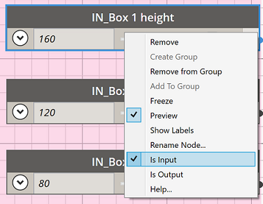
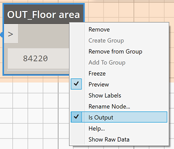
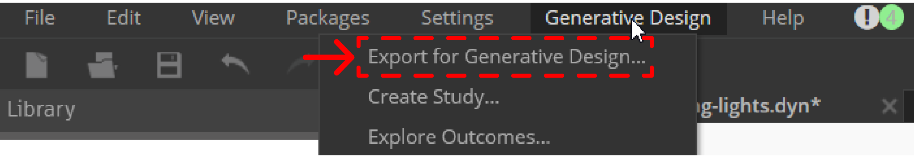
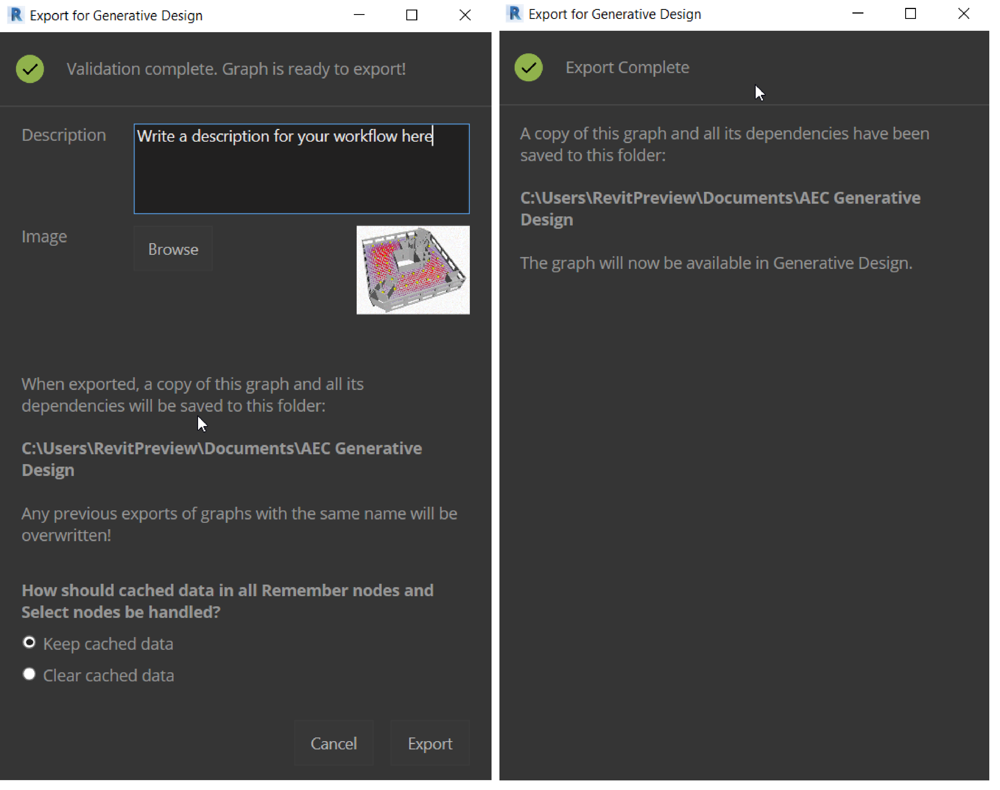
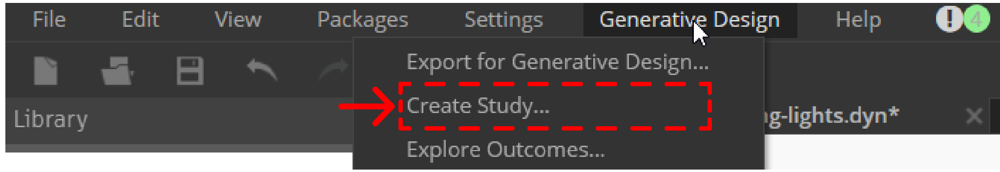
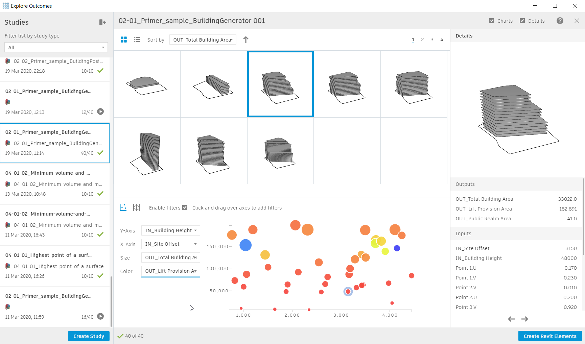

# 设定衍生式设计脚本

## 输入

为使用衍生式设计工具，需对一个Dynamo图形进行输入节点的设定。在每个用来驱动图形的节点上右击鼠标，确定选中“是输入”。通过一个标准的方式将该节点进行重命名，如：“IN_描述内容”，这将有助于在创建研究对话框中区分这些输入参数。

1. 在每个输入节点上右击鼠标，确定选定“是输入”选项。
2. 按上述说明重命名节点。
3. 为带滑动选择的节点设定其最小、最大和步长的值。

_注意：目前来说，所有的输入节点类型必须是“Number”、“Integer”滑动选择节点，或者“Revit Selection”节点。_

## 输出

为使用衍生式设计工具，需对一个Dynamo图形进行输出节点设定。在watch节点上右击鼠标，确定选中“是输出”。通过一个标准的方式将该节点进行重命名，如：“Out_描述内容”，这将有助于在创建研究对话框中区分这些输出参数。

1. 右键点击watch节点，选择选项“是输出”。
2. 按上述说明重命名节点。

_注意：目前来说，所有的输出必须是watch节点，并且输出数据类型为“Number”。_

## 导出衍生式设计

当正确设置好上述输入和输出并且保存了Dynamo图形后，你便可以将其通过衍生式设计工具集导出使用。在Dynamo中，通过工具栏选择衍生式设计Generative Design - 导出用于衍生式设计Export for Generative Design

Dynamo将创建一份当前脚本图形的拷贝，然后在创建分析Create Study中运行。
要创建一个导出用于衍生式设计的拷贝，需要做到下面几项：

1. 在Dynamo中，从工具栏中找到衍生式设计 > 导出用于衍生式设计。Dynamo将创建一份当前脚本图形的拷贝。

_注意：每次导出时，有相同名称的脚本图形将被覆盖。_

## 运行衍生式设计

请按照如下方法运行衍生式设计：

1. 在Dynamo中，从工具栏中找到衍生式设计 > 创建分析

在运行创建分析弹出的对话框中，选择你从Dynamo中导出的一个分析案例。

