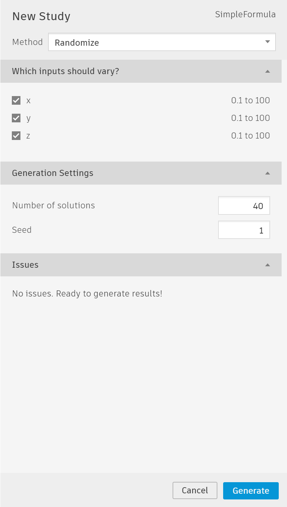
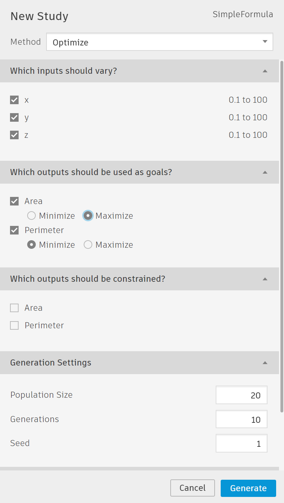

# 运行衍生式设计

衍生式设计分析能以不同的方式运行。在创建分析窗口中，您能够从四种不同的衍生式方法（详细内容请查看“求解器”一节）中选择。

## 怎样运行一个优化过程

一个优化过程能够使你探索Dynamo图形能够产生的所有可能方案。衍生式设计基于你在Dynamo图形中定义的约束条件生成所有的方案。
运行一个优化过程需要如下步骤：（此处说明和软件中的显示不太一致）

1. 从Dynamo的衍生式设计的工具栏中运行创建分析。
2. 定义一个新的分析并且选择“随机”为生成方法（详细内容请查看“求解器”一节）。
3. 确认你需要的所有输入参数都显示在“输入”一栏中。在每次运行时，输入参数不应该变化，设定需要的值，或者通过不选择复选框而取消某一项输入参数。
4. 在“输出”栏中确认每个Dynamo图形定义的输出项都显示在列。
5. 在“生成设置”栏中，选择你要创建多少个方案。
6. 在“生成设置”栏中，选择一个随机种子（或者，数字）作为随机生成的方法。
7. 在“问题”栏中，解决所有提示的问题点。
8. 最终，通过点击“生成”在运行你的优化过程。

## 怎样运行一个优化过程
一个优化过程利用计算机来解决你的设计，找到基于约束条件和提供目标的最适合可选项。

衍生式设计使用[NSGA-II](https://www.iitk.ac.in/kangal/Deb_NSGA-II.pdf)算法，即一种精英级的多目标衍生式算法来优化方案。

运行一个优化过程需要如下步骤：
1. 从Dynamo的衍生式设计的工具栏中运行创建分析。（原文有误）
2. 定义一个新的分析并且选择“优化”为生成方法（详细内容请查看“求解器”一节）。
3. 确认你需要的所有输入参数都显示在“输入”一栏中。在每次运行时，输入参数不应该变化，设定需要的值，或者通过不选择复选框而取消某一项输入参数。
4. 在“设定约束”栏中确认每个对象，并且设置你希望达到的优化目标 - “最大化”、“最小化”或者“忽略”。
5. 在“生成设置”栏中，设定人口规模 - 这个数值表示衍生式设计每一代运算的可选数量。
6. 在“生成设置”栏中，设定你要创建的生成的数量。要记住，每新一代都有一系列介于上一代的两个最佳设计之间的选择。
7. 最终，通过点击“生成”在运行你的优化过程。

