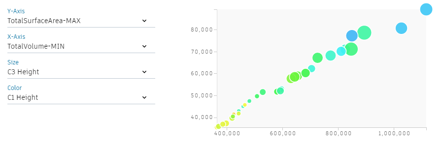

# 衍生式设计的结果可视化
在运行衍生式设计以后，结果会以一系列图形和表格的形式在浏览结果页面中显示。页面中的所有结果都是相关联的，在一种形式中选择选项，在另一种形式的页面中就会高亮显示结果。

## 设计网格

设计网格展示了每个选项的三维几何截图，每个截图都可以进一步被仔细地旋转、缩放和浏览。
截图的顺序可以根据Dynamo脚本的输入或输出参数进行排序，并且可以调整其升序和降序的排序方式。

## 设计表

设计表在相同的位置替换了设计网格显示的结果。通过选择，该表格每行分别列出了每个输入参数及其输出结果。

## 散点图

浏览结果页面中的第一个数据可视化图是散点图。这是一种使用笛卡尔坐标显示一系列数据的数学图形。
衍生式设计允许你分别为X轴和Y轴指定数据，并且分别为圆圈的大小和颜色指定数据来形成4D展示图。这些数据可以从你上一步的Dynamo图形中定义的输入参数或者输出参数中选择。
在该展示图中选择圆圈也能够使其在设计网格或者设计表中对应高亮。

## 平行坐标图

浏览结果页面的另一个数据可视化图是平行坐标图。这个图展示了一系列等距放置的竖向平行线，用来表示所有的输入参数和输出参数。每个计算方案以一条多段线表示，多段线顶点在轴上的位置对应于输入参数或输出参数的值。

## 选择正确的显示方式

你为你的项目选择的显示方式可因你在执行哪种类型的过程有关：
如果你在运行一个`优化`过程，使用平行坐标图来显示结果是有好处的，它使你在运行并探索不同的目标时过滤选项方案更加容易。
如果你在运行一个多目标`优化`过程，最好使用散点图来显示结果，它会更加容易让你找到两个对象的最佳权衡点并且按到帕累托阵面。对于多目标优化和怕累多阵面的更多资料可以参考对象函数一章。