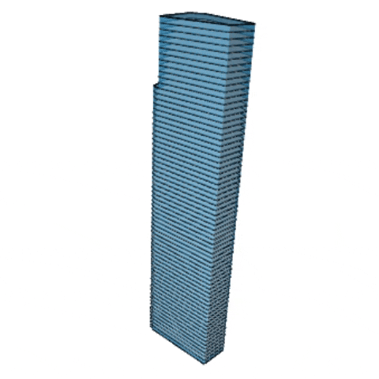
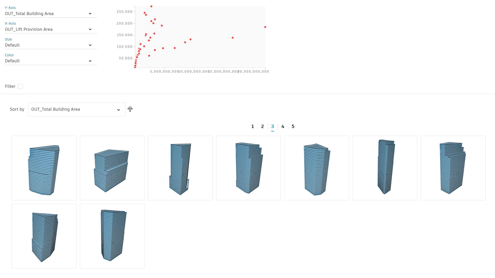

# 建筑体量的衍生

  

## 描述

使用 _`随机`_ 模式，这个图形将生成一系列随机塔楼，在整个规定的场地边界中。

随机设置塔楼的高度、楼层平面和朝向，在几分钟内就能生成大量的可选设计方案。

我们使用随机方法是因为在该案例中我们更注重建筑形体的变化，而不仅仅是对评估器的优化。该工作流中的一些变量是用来创建变化的，而不是用来优化的，所以用该随机方法更加合适。

[下载工作流文档](https://github.com/DynamoDS/RefineryPrimer/releases/download/samples-v2/04-02-01_Building-mass-generator.zip)

## 静态输入

| 名称 | 描述  |
| :--- | :--- |
| 场地边界 | 从Revit（的模型曲线）中选择边界线 |

## 变量输入

| 名称 | 描述  |
| :--- | :--- |
| 场地退线 \(mm\)  | 从场地边界偏移的数值 |
| 建筑高度 \(mm\)  | 塔楼总高度的范围 |
| 楼层高度 \(mm\)  | 塔楼楼层间高度的范围 |
|   U值 \(%\)       | 用来创建首层楼层平面的七个点所在平面的U值 |
|   V值 \(%\)       | 用来创建首层楼层平面的七个点所在平面的V值 |

## 函数

该脚本由一系列函数组成，这些函数在图形中被分成了不同的组。每一组有一个名字以及一个简单的描述，名字用来说明函数类型，描述用来进一步说明具体过程。

该图形从Revit中获取场地边界，并且由用户确定U和V的值，然后在允许的空间中为新的塔楼生成其首层楼层平面。用建筑高度和楼层高度，脚本会基于首层楼层平面的细微变化生成整个所有楼层楼板。所有楼层楼板创建完成后，脚本通过楼板外边界轮廓拉伸生成建筑外墙。

生成整个建筑的几何体后，脚本会基于输出参数评估设计结果。

## 评估器

| 名称 | 描述  |
| :--- | :--- |
| 公区面积 \(m2\) | 包含在场地轮廓内且在建筑楼层平面外的首层的面积 |
| 总建筑面积 \(m2\) | 整个建筑的总面积 |
| 电梯占用面积 \(m2\) | 电梯占用的总面积 |

## 使用衍生式的优势

运行Dynamo脚本时，基于用户输入的输入，每次运行会生成一个设计方案。而在Revit的衍生式设计中运行脚本，并且选择使用随机生成方式时，同时可以生成非常多的设计方案。

由于Dynamo图形的性质，其使用“随机”模式运行得很好。虽然输出值可被用于最大化或者最小化各种面积，但没有可用样式可以利用算法去优化。通过使用“随机”模式，衍生式设计可以生产成百上千中不同的迭代，从而允许用户去排序和探索所有的选项，得到最优方案。

## 结果

当该分析类型运行完成，我们便可以在结果浏览中通过表和图进行探索了。

下图展示了一个基于40个随机方案分析的输出结果。

## 视频培训





