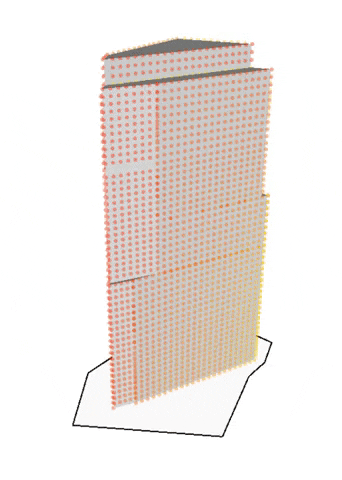
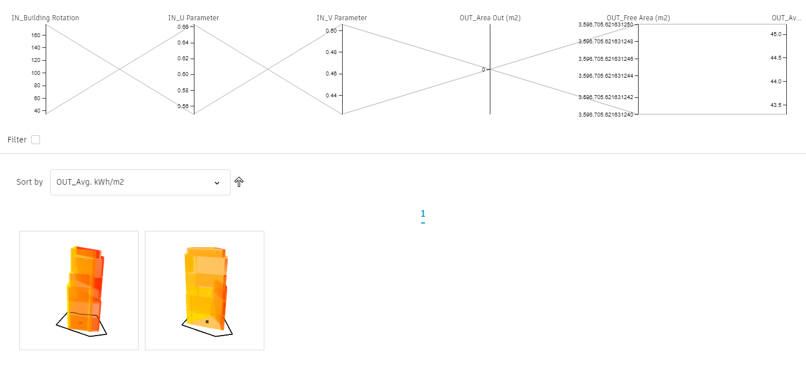

# 基于日照的建筑位置

  

## 描述

该图形用于移动和旋转选中体量的位置，该体量在场地轮廓内，并且按面积比最小化或最大化入射的日照。该工作流严重依赖Dynamo中的“Solar Analysis”节点，该节点通过调用外部网络服务得到必要的分析信息。

因此，每次迭代都会运行一会儿。对于那些移动或者旋转导致建筑会落在场地边界之外的方案，结果会被严重惩罚，从而使该分析不会运行。

[下载工作流文档](https://github.com/DynamoDS/RefineryPrimer/releases/download/samples-v2/04-02-02_Building-positioning.zip)

## 静态输入

| 名称 | 描述  |
| :--- | :--- |
| 场地边界 | 从Revit（的模型曲线）中选择边界线 |
| 周边建筑 | 选择会影响日照分析的周边元素。|
| 主建筑    | 选择要定位的体量（建筑）） |
| 场地退线 | 从场地边界偏移的数值 |
| 楼层高度 | 楼层间的净高 
| 定位坐标| 日照分析使用的实际坐标 |

## 输入变量

| 名称 | 描述  |
| :--- | :--- |
| 建筑旋转角度 \(degrees\) | 使建筑以其自己的初始点位进行旋转的0°到360°的角度 |
|   U值 \(%\)        | 建筑定位点所在平面的U值 |
|   V值 \(%\)        | 建筑定位点所在平面的V值 |

## 函数

该脚本由一系列函数组成，这些函数在图形中被分成了不同的组。每一组有一个名字以及一个简单的描述，名字用来说明函数类型，描述用来进一步说明具体过程。

该图形利用Revit的体量\(或者建筑\)，并且在Dynamo中抽取其几何体。所有周围高于30米的建筑也作为Dynamo中的参照几何体。

该脚本的生成提供了 \(基于U和V值\)的新位置。以及一个新的角度。建筑便移动到新的定位点，并且旋转到对应的新角度。如果建筑到了新的定位，并且在场地边界之内，日照分析便利用建筑的所有竖向表面计算其日照指数。

## 展示

在Dynamo中创建几何体时，通常还需要其他几何体来促进整个过程。

请注意在Dynamo中将所有不必要的几何体隐藏——这将确保显示的几何体都是最终作为结果输出的。任何节点的预览模式被设为关闭后，也不会在衍生式设计的输出结果中显示。在该案例中，只有主建筑物和日照分析计算结果是最终可见的。

日照分析以有色网格点的形式显示在建筑的外部表面上。这些点由黄色到红色，黄色的点表示低入射率、红色的点表示高入射率。

## 评估器

| 名称 | 描述  |
| :--- | :--- |
| 外部面积 \(m²\)  | 在场地边界外的建筑面积 |
| 自由面积 \(m²\)  | 场地边界内但是非建筑楼层所占用的面积|
| 平均入射指标 \(kWh/m²\)  | 建筑外墙的平均入射指标 |

## 衍生式设计的好处

如果没有方案自动创建的过程的话，设计师不得不通过手动调整建筑的位置，每次都运行Dynamo，直到最终找到他们所需要的的建筑定位点和旋转方向。这一过程将花费几个小时，设置几天的时间（ 除非他们足够的幸运 ）。

本样例的目标很简单（为最小或者最大入射指标找到最合适的建筑位置以及旋转方向），可以使用_`优化`_ 方法；更大的场地偏移值会限制建筑能够移动的空间，并且将减少建筑错误地落在场地边界以外的可能。

## 结果

一旦分析完成，结果便会通过表格和图形的方式在结果分析对话框中进行分享。

下面展示了一张基于十代20个种群的优化研究的结果。输出结果定义为同时满足_`最小外部面积(m2)`_ 和_`最小平均入射指标(kWh/m2)`_ 。

## 视频资料



