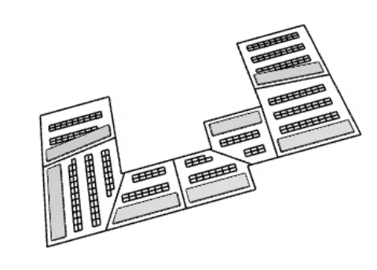
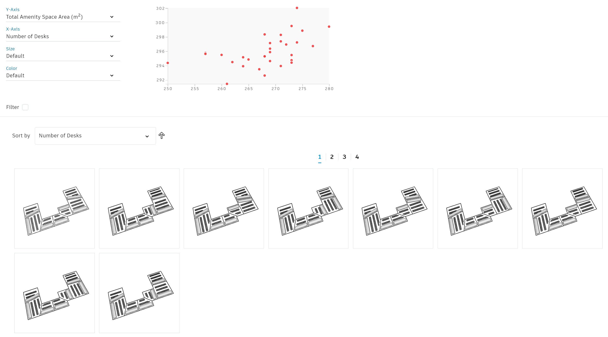

# 4.2.3 办公室布局

  

## 描述

该图形生成基于楼层平面以及相邻边界的一系列桌子平面的排布。桌子以横向或者纵向的方式排成一列，并在旁边为便利设施预留空间，例如休息空间或者茶歇空间。

目的是要找到在平面内既满足布置桌子数量的最大化，又同时满足便利设施的高面积的方案。

[下载样例文件](https://github.com/DynamoDS/RefineryPrimer/releases/download/samples-v2/04-02-03_Office-layout.zip)

## 静态输入

| 名称 | 描述  |
| :--- | :--- |
| 楼层平面 | 选择的楼板的几何体 |
| 相邻边界 | 选择相邻的边界（模型线）|
| 桌子宽度  \(mm\)    | 办公桌的宽度 |
| 桌子深度 \(mm\)  | 办公桌的深度 |
| 背对背的容差 \(mm\)  | 用户背对背坐时两桌子间的距离 | 

## 输入变量

| 名称 | 描述  |
| :--- | :--- |
| 边界起点 | 沿楼板边界每条边界的起点 |
| 边界终点 | 沿楼板边界每条边界的终点 |

## 函数

该脚本建立了一系列函数，并且将其在图形中成组。每一组都有一个名字和简短的描述，名字说明了运行函数的功能，描述进一步进行详细的解释。

该图形从楼板几何体中提取底部表面并且构建了其周长曲线。相邻边界在这些周长曲线上，并且能够在脚本定义的误差范围内进行移动。边界的移动导致了相邻空间的变化，同时提供了新的楼板平面以及新的布置方式。舒适空间由基于最长曲线偏移后生成，最后在剩下的空间中以最有效的方式布置桌子。

## 展示

Dynamo中几何体生成后，其他几何体需要为整个过程提供方便。

要记住，应当在Dynamo中关闭所有没有必要的几何体的预览功能。这样才能保证最终输出的几何体显示的正确性。任何关闭了预览功能的节点在探索输出中也不会显示其几何体。

因此，仅有楼板平面的周长曲线、相邻边界以及舒适空间和办公桌会显示。舒适空间会以灰色填充显示，从而区别于其他几何体。

## 评估器

| 名称 | 描述  |
| :--- | :--- |
| 舒适空间面积 \(m²\) | 由舒适空间占用的总面积 |
| 桌子的数量 \(u\)  | 办公桌的总数量 |

## 衍生式设计

设计师布置诸如办公室和卫生间这样的平面可能要花费数小时的时间。通过创建这种（桌子数量最大化并且舒适空间最大化）目标清晰的算法，使用优化的求解方法更快地得到最佳方案。

## 结果

衍生式计算完成后，我们可以从探索输出对话框中通过表格和图表进行结果的探索。下图展示了以随机方式生成的35个样例输出结果。

## 视频资料




