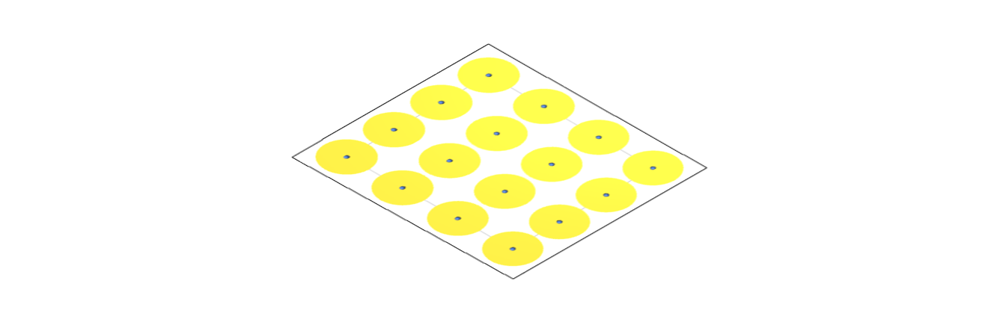
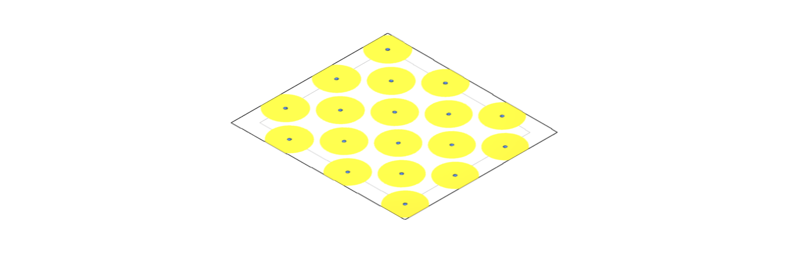
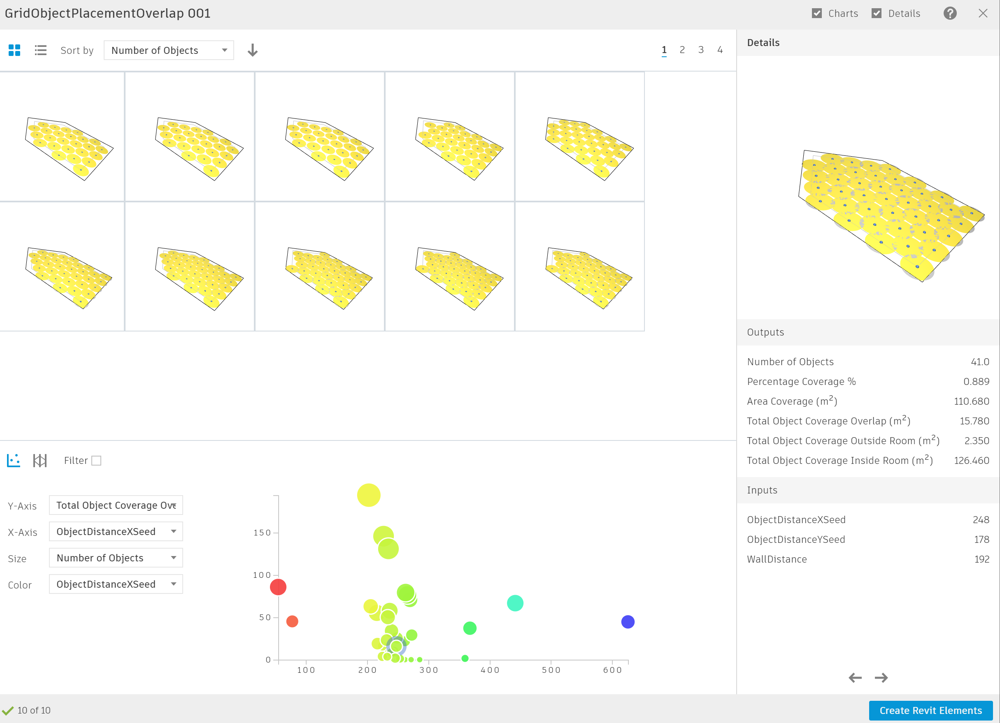

# 房间内网格对象的放置

  

## 描述

该图形用优化方法在房间/空间内以网格/阶梯型网格的形式放置对象。图形将比较总覆盖率的百分比，放置对象的数量以及对象影响范围的面积，同时通过衍生式设计探索各种配置。

虽然是简化了的方法，该图形能够作为更复杂并且与您的项目或者实践相关的个性化标准的基础。

该样例文件可以在最新版本的Revit衍生式设计中得到。

该工作流提供了两种网格布置形式供您选择，具体要看哪种跟适合您的工作流：

- 矩形网格
- 阶梯型网格

## 网格

### 矩形网格

  

在矩形网格中，元素都通过X轴和Y轴进行对齐。这种格式类型适用于您需要元素以常规的直线式循环布置的情况。这种网格的典型应用可以是床、学校课桌、陈列柜等的布置。

### 阶梯式网格

  

在阶梯式网格中，对象不再与每个轴对齐，以避免刚性的x-y形成，而是通过一种钻石分布的样式。这种网格通常用来避免对象影响半径交叠的影响。阶梯式网格可以用来对桌子、植物、餐桌等的放置。

## 静态输入

| 名称 | 描述  |
| :--- | :--- |
| 房间      | 放置对象的房间 |
| 影响半径 | 用于优化算法的对象影响半径 |
| 到墙的最小距离  | 为确定从对象网格到墙的距离的随机种子设定一个最小值 |
| 对象间的最大距离 | 为确定网格内对象间的距离的随机种子设定一个最大值 |

半径、最小值和最大值的约束只能在Dynamo调整。

## 输入变量

| 名称 | 描述  |
| :--- | :--- |
| 墙距离 \(种子\)  | 给定一个网格到墙距离的随机值。该值由静态输入中到墙最小距离和最大距离确定 |
| 对象X方向距离 \(种子\)  | 网格中X轴方向对象间的距离。该值有静态输入中对象间最小和最大距离确定 |
| 对象Y方向距离 \(种子\)  | 网格中Y轴方向对象间的距离。该值有静态输入中对象间最小和最大距离确定 |

## 图形描述

该脚本建立了一系列函数，并且将其在图形中成组。每一组都有一个名字和简短的描述，名字说明了运行函数的功能，描述进一步进行详细的解释。

该图形将输入一个模型元素，一个房间和放置网格的变量。房间表面和周长用来计算后续的标准。接下来，指定随机值给墙和网格初始点的距离，以及X轴和Y轴的距离。

这些值用来创建房间内的点。由图形确定每个对象对另外一个对象影响的面积，以及房间的周长。

利用优化的方式，得到当整个对象的覆盖面积最小的同时对象的覆盖面积和对象数量的最大值。

## 评估器

| 名称 | 描述  |
| :--- | :--- |
| 覆盖百分比 \(%\)  | 对象影响半径范围所覆盖房间面积的百分比 |
| 覆盖面积 \(m²\) | 对象影响半径范围覆盖的总面积 |
| 对象数量 (u)    | 房间中放置对象的数量    |
| 内部对象覆盖面积 \(m²\) | 内部对象覆盖面积 |
| 外部对象覆盖面积 \(m²\) | 外部（周长）对象覆盖面积 |
| 所有对象覆盖面积 \(m²\) | 所有内部和外部对象的覆盖面积 |

## 结果

结果展示将现实各种网格的选项。该样例中，你能通过分别指定X轴和Y轴为X和Y的种子值。每个结果显示为一个点，点的大小由每个计算结果中的对象的数量决定。

衍生式计算完成后，结果便能在结果展示页面中通过表格和图表进行分析。下面的结果显示了以四个世代20个种群进行优化分析的结果。

## 视频资料



