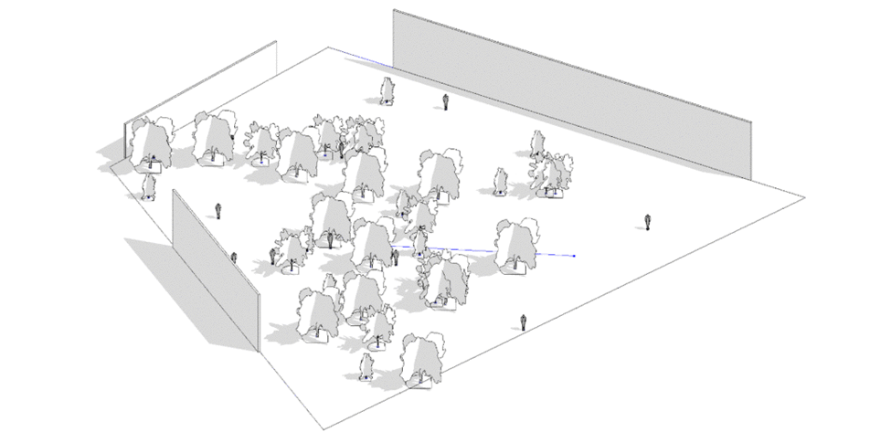

# 环境元素放置分析

## 描述

  

该图形将生成一系列不同的环境元素。环境元素被放置在集群中，其模仿了空间中随机元素位置的有机位置。

从选择一个空间/房间入手，接着选择环境元素（人物、数等）。然后，为您的不同集群设置约束，最终检查标准，即这些元素间相互的关系是怎样的。

该流程试图使用“随机”模式。因此，不需要优化评价标准，
然而，需要提供一些输出以更好地查看每个场景的（某些）属性。

你可以使用该流程快速生成多种场景来节省时间，不需要手动放置每个元素。

该样例文件在最新版的Revit的衍生式设计中能够找到。

## 静态输入

| 名称 | 描述  |
| :--- | :--- |
| 房间      | 放置对象的房间 |
| 环境族 | 每个你想包括在你的环境中的元素的族实例 |

## 约束条件

| 名称 | 描述  |
| :--- | :--- |
| 集群的最大/最小数量 \(u\)  | 集群数的范围 |
| 每个集群中空间的最大/最小数量 \(u\)  | 每个集群中空间数的范围 |
| 每个集群中元素的最大/最小数量 \(u\)  | 每个集群中元素的数的范围 |

## 输入变量

| 名称 | 描述  |
| :--- | :--- |
| 集群数量种子 | 确定集群的数量 |
| Us/Vs种群种子 | 确定每个种群的UV位置 |
| 集群中空间的种子 | 确定每个集群的空间 |
| 每个集群空间的元素的种子 | 确定每个集群中元素的数量 |
| 元素位置的种子 | 确定每个集群中元素的位置 |

## 函数

该脚本建立了一系列函数，并且将其在图形中成组。每一组都有一个名字和简短的描述，名字说明了运行函数的功能，描述进一步进行详细的解释。

该脚本从导出一个房间的表面开始。该房间将被用来放置环境元素。然后，创建一系列元素集群。接着，在随机将族实例放置在对应的点上之前，先要将在指定的房间内的元素过滤出来，再放置。度量值将基于新的族实例和相关的点进行计算。

## 可视化

计算将在结果显示中并列显示选择的房间的表面，相关点以及环境元素。我们建议您将其余3D视图相结合，从而将结果输出到Revit。

## 评估器

该样例中没有优化设计，但是会有一些指标将提供有关您创建的场景的信息。

| 名称 | 描述  |
| --- | --- |
| 元素数量 \(u\) | 场景中创建的元素的数量 |
| 总间距 \(mm\) | 场景中元素间的距离 |

## 结果

生成计算完成后，结果可以通过结果分析对话框中的表格和图表进行分析。

下图显示了基于40个随机值的计算结果。

## 一个更有机的随机高斯分布

随机布置元素时的一个需要理解的重要概念是高斯分布。

使用高斯正态分布，而不是常规的随机方法，你能够控制元素的集群，因而你放置的结果会更加有机。

进一步了解相关知识，请参考下面的网页链接：

[https://natureofcode.com/book/introduction/ ](https://natureofcode.com/book/introduction/)

## 视频资料



